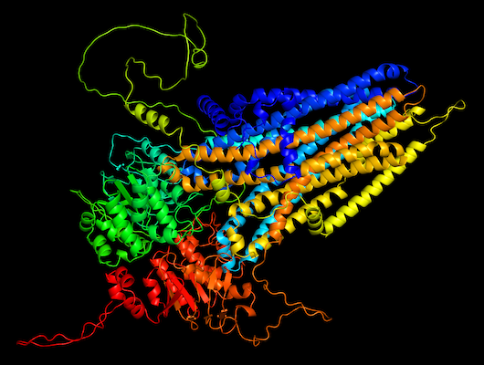
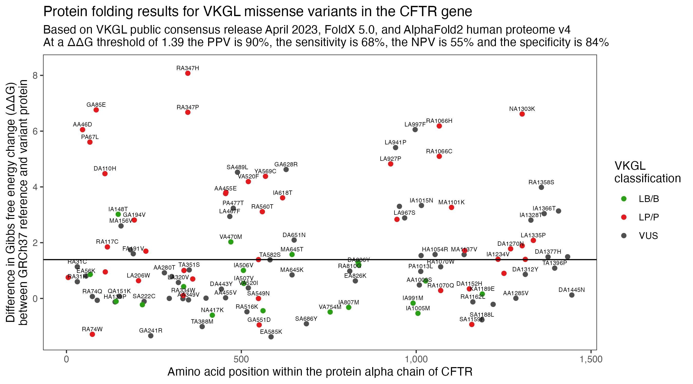

# Protein folding on VKGL data

Deep learning has recently greatly enhanced our knowledge on protein structures while
sophisticated algorithms for molecular dynamics have become accessible.

Perform folding of GRCh37 reference proteins and VKGL variant protein.
and calculate the difference in Gibbs free energy change (ΔΔG)
increase in ΔΔG less favourable folding, pathogenic

Example

Youden's J statistic placed the threshold at 1.39.
According to the data, the chance that a variant is correctly labeled 'pathogenic' above this threshold is 90% (PPV) and 68% of all pathogenic variants can be found this way (sensitivity).

Results

Based current limited set of 35 genes, median threshold of 1.15762
which is close to previously found 1.58 and 1.50 ([link](https://www.nature.com/articles/s41598-020-72404-w))

## Data used

### VKGL public consensus release April 2023
* Fokkema, IFAC, van der Velde, KJ, Slofstra, MK, et al. Dutch genome diagnostic laboratories accelerated and improved variant interpretation and increased accuracy by sharing data. Human Mutation. 2019; 40: 2230–2238. https://doi.org/10.1002/humu.23896
* [Direct download link](https://downloads.molgeniscloud.org/downloads/VKGL/VKGL_public_consensus_202304.tsv)

### AlphaFold2 human proteome v4
* Tunyasuvunakool, K., Adler, J., Wu, Z. et al. Highly accurate protein structure prediction for the human proteome. Nature 596, 590–596 (2021). https://doi.org/10.1038/s41586-021-03828-1
* [Direct download link](https://ftp.ebi.ac.uk/pub/databases/alphafold/latest/UP000005640_9606_HUMAN_v4.tar)

## Software

### FoldX 5.0
* Javier Delgado and others, FoldX 5.0: working with RNA, small molecules and a new graphical interface, Bioinformatics, Volume 35, Issue 20, October 2019, Pages 4168–4169. https://doi.org/10.1093/bioinformatics/btz184
* [Download under license](https://foldxsuite.crg.eu)

### R
* R version 4.2.3 (2023-03-15) -- "Shortstop Beagle"
  Copyright (C) 2023 The R Foundation for Statistical Computing
  Platform: aarch64-apple-darwin20 (64-bit)
* [Download via R-project](https://www.r-project.org)

### Java
* Oracle OpenJDK version 18.0.1
* [Download](https://www.oracle.com/java/technologies/downloads)

